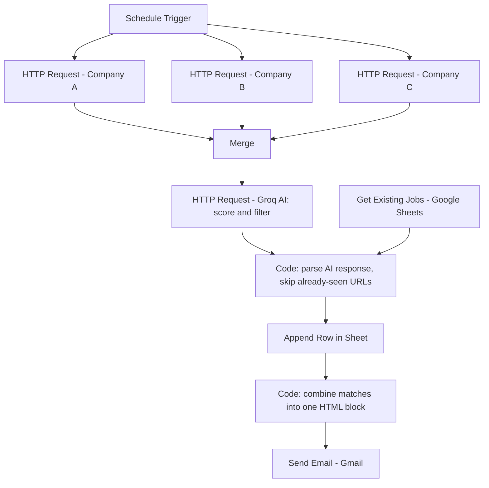

# Smart Job Tracker — AI-Powered Automation with n8n

An automated workflow that scans multiple company career pages daily, uses AI to score and match job listings against a target profile, and delivers a single consolidated email with only the relevant, new opportunities — no manual searching required.

## Overview

Manually checking career pages every day for relevant roles is repetitive and time-consuming. This workflow automates the entire process:

1. **Fetches** job listings daily from multiple companies' public career APIs (Greenhouse)
2. **Filters against history** — cross-checks against previously seen jobs (via Google Sheets) so only genuinely new postings move forward
3. **Scores with AI** — sends new listings to an LLM (via Groq) which filters and scores each job against a defined profile: role type, experience level, location, and recency
4. **Logs results** — appends matched jobs to a Google Sheet for tracking (with an "Applied Status" column)
5. **Sends one email** — combines all matches from that run into a single, consolidated HTML email, rather than one email per job

## Design Rationale

A naive version of this workflow (re-fetch everything, email every match every time) creates two problems:

- **Duplicate spam** — the same job re-appearing in every run, sent as a separate email each time
- **Irrelevant matches** — AI models can over-match on loose keywords (e.g. matching any listing that mentions "AI" in the description, even sales or consulting roles)

This project's design addresses both:

- A **"Get existing jobs"** step reads current Sheet data before appending, so only new URLs are added and re-sent
- A **tightly scoped system prompt** explicitly defines target role types, experience-level cutoffs, and location rules, with explicit exclusion rules for out-of-scope roles (sales, marketing, consulting, senior/staff titles, etc.)
- A **combine step** merges all matched jobs from a run into a single HTML block before the email node sends it, so the recipient gets one email regardless of whether 1 job matched or 50

## Workflow Architecture

## Tech Stack

## Tech Stack

| Component | Purpose |
|---|---|
| n8n | Workflow orchestration / automation engine |
| Greenhouse Job Board API | Public source of job listings (no auth required) |
| Groq API (Llama 4 Scout) | LLM-based job scoring, filtering, and matching |
| Google Sheets | Persistent log and duplicate-detection source of truth |
| Gmail API | Email delivery of the daily digest |

## Setup

1. Import the workflow JSON into an n8n instance (Cloud or self-hosted)
2. Connect the required credentials:
   - Google Sheets OAuth (for logging and duplicate checks)
   - Gmail OAuth (for sending the digest)
   - Groq API key (for AI scoring — console.groq.com)
3. Update the HTTP Request nodes with the Greenhouse board slugs for the companies to track:
